# mongdock (몽독)

윈도우 11을 맥처럼 쓰게 해 주는 독 + 상단바. C# / WPF / .NET 8, 외부 패키지 없음.

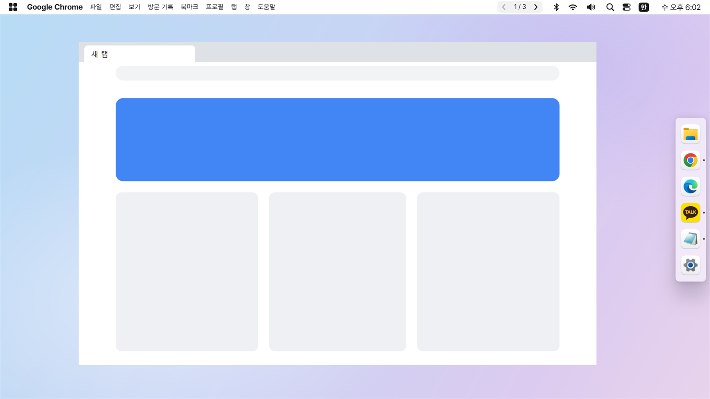

맥에서 원격 데스크톱으로 윈도우에 접속하면 Ctrl+Win+화살표(가상 데스크톱), 한/영, Win+A, Ctrl+Shift+T 같은 단축키가 잘 넘어가지 않는다. mongdock 은 그런 기능을 **클릭만으로** 쓰게 하는 것이 주 목적이다. 독과 상단바는 클릭해도 포커스를 가져가지 않아서, 한/영 전환이나 메뉴 단축키가 지금 쓰던 앱에 그대로 들어간다.

## 설치

### 설치 프로그램 (권장)
1. [Releases](https://github.com/mong-head/mongdock/releases) 에서 `mongdock-<버전>-setup.exe` 를 받아 실행한다. 관리자 권한은 필요 없고, `%LOCALAPPDATA%\Programs\mongdock` 에 설치된다. .NET 설치도 필요 없다.
2. 설치 중 "로그인 시 자동 실행"(기본 켜짐), "바탕 화면 바로 가기"(기본 꺼짐)를 고를 수 있다. 마지막 화면의 "mongdock 실행" 으로 바로 켠다.

### 업데이트
새 버전의 `setup.exe` 를 받아 실행하면 끝. 실행 중인 mongdock 을 알아서 끄고 덮어쓰며, 설정(`%APPDATA%\mongdock`)과 핀은 그대로 남는다. 앱에서 켜 둔 "로그인 시 자동 실행" 도 유지된다 (설치 화면에서 직접 끈 경우에만 해제).
버전마다 바뀐 점은 앱의 **설정 → 변경 내역**에서 볼 수 있다.

몽독이 GitHub 릴리스를 시작 1분 뒤·12시간마다 확인해 새 버전이 있으면 로고 메뉴·트레이 메뉴 맨 위와 설정 → 정보에 알려 주고, "지금 업데이트" 한 번이면 setup.exe 를 받아(크기·SHA-256 확인) 조용히 설치한 뒤 다시 켠다 (설치 프로그램 위치가 아닌 곳에 zip 으로 풀었다면 릴리스 페이지만 열어 줌, 설정 → 정보에서 자동 확인 끄기·이 버전 건너뛰기 가능).

### 설치 없이 쓰기 (zip)
1. Releases 에서 `mongdock-<버전>-win-x64.zip` 을 받아 원하는 폴더(예: `%LOCALAPPDATA%\Programs\mongdock`)에 푼다.
2. `mongdock.exe` 실행.
3. 컴퓨터를 켤 때 자동으로 켜려면: 알림 영역의 mongdock 아이콘 오른쪽 클릭 → "로그인 시 자동 실행".

처음 실행하면 독에 Finder(파일 탐색기), Launchpad(시작 메뉴), 브라우저, 설정이 고정된다. 다른 앱은 실행 중일 때 독 아이콘을 오른쪽 클릭 → "독에 고정".

> 코드 서명이 없어서 처음 실행할 때 "Windows의 PC 보호" 창이 뜰 수 있다. "추가 정보" → "실행" 을 누르면 된다.

### 직접 빌드
.NET 8 SDK 필요.

```bash
dotnet build -c Release
```

배포용 파일 만들기 (`dist\mongdock-<버전>-win-x64.zip` + `dist\mongdock-<버전>-setup.exe`):

```bash
powershell -ExecutionPolicy Bypass -File build-release.ps1 -Version v0.2.0
```

설치 프로그램은 [Inno Setup 6](https://jrsoftware.org/isinfo.php) 이 있어야 만들어진다 (없으면 zip 만 만든다). 스크립트는 `installer\mongdock.iss`.

## 화면

### 상단바

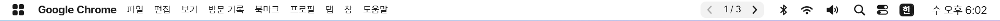

왼쪽부터 윈도우 로고 메뉴 · 앞에 있는 앱 이름 · 그 앱의 메뉴, 오른쪽은 가상 데스크톱 ‹ 1/3 › · 블루투스 · Wi-Fi · 사운드 · 검색 · 제어 센터 · 한/영 · 시계.

| 앱 메뉴 (크롬 "파일") | 윈도우 로고 메뉴 |
|---|---|
| 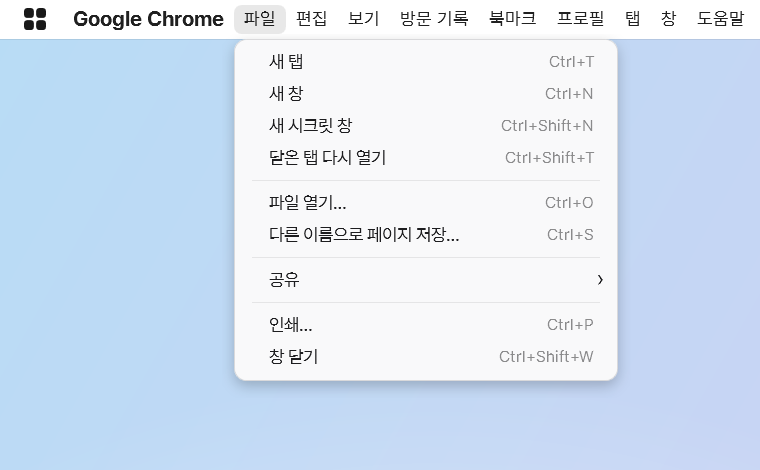 | 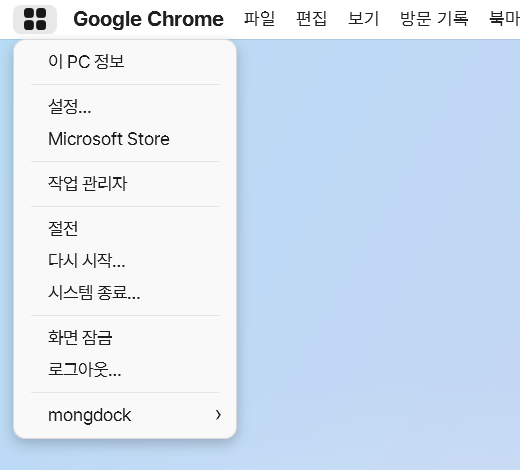 |

- **앱 메뉴**: 일반 윈도우 메뉴가 있는 앱은 그 메뉴를 그대로, 브라우저·탐색기·노션 등은 단축키 메뉴를 보여 준다. 누르면 그 단축키가 앱에 들어간다. 메뉴 하나를 연 채 옆 제목으로 마우스를 옮기면 바로 바뀐다.
- **로고 메뉴**: 이 PC 정보, 설정(윈도우), Microsoft Store, 작업 관리자, 절전 · 다시 시작 · 시스템 종료 · 화면 잠금 · 로그아웃 (다시 시작·종료·로그아웃은 확인 후 실행), "mongdock 설정…".
- **가상 데스크톱**: ‹ › 로 이동, 가운데 숫자를 누르면 작업 보기(전체 데스크톱 보기).
- **시계**: 누르면 몽독 달력(한국 공휴일·대체공휴일 표시)과 그 아래 알림 목록. 몽독에서 지운 알림은 몽독 화면에서만 숨겨진다(윈도우는 다른 앱의 알림을 지울 수 없게 막아 둬서, 윈도우 알림 센터(Win+N)에는 남는다).
  달력 날짜를 누르면 그 날(공휴일·음력·며칠 전/후)을 보여 주고, 두 번 누르거나 "캘린더에서 열기" 로 설정 > 캘린더 > 캘린더 앱(Google·Outlook·네이버 웹, 설치된 새/클래식 Outlook)에서 연다. 휠로 달 이동.
- **캘린더 일정 (iCal 구독)**: 설정 → **캘린더** 에서 Google·Outlook.com 캘린더의 iCal(ICS) 주소를 복사한 뒤 "클립보드에서 추가" 를 누르면(키보드 입력 없음) 달력에 일정이 보인다 — 일정 있는 날 숫자 아래 색 점, 날짜를 누르면 그 날 일정 목록(시간·제목·장소). 반복 일정·예외·종일·시간대를 처리하고, 15분(5/15/30/60분 선택)마다 새로고침, 몽독 일시 정지 중엔 멈춤. 구독 주소는 비밀 링크라 `%APPDATA%\mongdock\calendars.json` 에 DPAPI(현재 사용자)로 암호화해 저장하고 로그에는 호스트 이름만 남긴다. 받은 일정은 `cache\calendars\` 에(역시 암호화) 캐시해 재시작 직후에도 바로 보인다. 개인 네이버 캘린더는 구독 주소를 제공하지 않는다.
- **블루투스**: 오디오 기기(이어폰·스피커)는 눌러서 바로 연결/해제, 그 밖의 기기는 눌렀을 때 윈도우 블루투스 설정이 열린다.
- **앱 트레이 아이콘**: 카카오톡·디스코드 같은 앱의 알림 영역 아이콘. 윈도우 11 의 "작업 표시줄에 항상 표시"(설정 > 개인 설정 > 작업 표시줄 > 기타 시스템 트레이 아이콘)를 켠 앱은 상단바에, 나머지는 ⌃ 안에 둔다. 상단바 아이콘을 끌어 ⌃ 에 놓으면 안으로, ⌃ 안의 아이콘을 끌어 상단바에 놓으면 밖으로, 바 안에서 끌면 순서가 바뀐다 (몽독에서 옮긴 자리가 윈도우 설정보다 우선, 재시작해도 유지). 설정 > 상단바 > "트레이 아이콘 정리" 에서 클릭으로도 바꿀 수 있고 "윈도우 설정대로 되돌리기" 로 초기화한다. 끄는 중 오른쪽 클릭이면 취소.
  - 원리: 앱들이 작업 표시줄에 보내는 트레이 아이콘 등록을 몽독이 먼저 받아 그대로 윈도우(explorer)에 전달하고, 같은 아이콘을 상단바에도 그린다 — 앱은 평소처럼 동작하고 작업 표시줄 트레이도 그대로다.
  - 새 설치는 작업 표시줄 숨기기와 함께 켜짐(기존 설정은 그대로). **"윈도우 작업 표시줄 숨기기" 를 켜면 자동으로 켜진다**(작업 표시줄이 없으면 트레이 아이콘에 닿을 곳이 상단바뿐이라). 설정 창이나 메뉴에서 직접 켜거나 끈 뒤에는 그 선택을 따른다.
  - 어떤 앱 아이콘이 이상하게 동작하면: 설정 > 상단바 > 표시할 항목 > "앱 트레이 아이콘" 을 끈다 (또는 `topBar.showTrayIcons` 를 `false`). 끄면 앱들은 곧바로 원래처럼 윈도우 작업 표시줄에만 등록한다. 일시 정지 중에도 꺼진다.
- **여러 모니터**: 상단바는 모든 모니터에 표시(설정에서 주 모니터만으로 바꿀 수 있음), 독은 고른 모니터 하나에 표시.

### 검색 (Spotlight)

상단바 검색 버튼이나 전역 단축키로 화면 가운데에 맥 Spotlight 같은 검색창이 뜬다.

- 결과는 카테고리별(최상위 히트 · 응용 프로그램 · 시스템 설정 · 폴더 · 문서 · 사진·동영상·음악 · 기타 파일)로 묶여 나온다
- **앱**: 이름으로 찾는다. 한글 초성 검색 가능 (예 `ㅋㅋㅇㅌ` → 카카오톡)
- **윈도우 설정**: 블루투스·디스플레이·소리·Wi-Fi·배경화면 같은 설정 페이지 약 50개 (예 `ㅂㄹㅌㅅ`, `해상도`)
- **계산기**: `12*3+4`, `200*15%`, `2^10` 처럼 입력하면 맨 위에 결과. Enter 로 결과를 복사
- **파일·폴더**: 윈도우 검색 색인에서 파일 이름으로 찾는다(최근 수정순). Enter 로 열고, Ctrl+Enter(또는 마우스를 올리면 나오는 "폴더에서 보기")로 탐색기에서 위치를 연다. 색인 서비스가 꺼져 있으면 파일 결과만 빠진다
- 결과 맨 아래 "Windows 검색에서 찾기" / "웹에서 검색"(Google·네이버·Bing) 으로 같은 검색어를 넘길 수 있다
- 설정 → **검색** 에서 항목별 켜기/끄기, 파일 검색 위치(폴더 추가/빼기), 카테고리별 최대 개수(3~10), 웹 검색 엔진을 고른다
- 단축키: **자동**(기본 — 입력 언어가 1개면 Win+Space, 여러 개면 언어 전환과 겹치지 않게 Alt+Space) / Win+Space / Alt+Space / Ctrl+Space / 사용 안 함
- 검색 버튼을 윈도우 검색으로 바꿀 수도 있다 (설정 → 검색 → 검색 버튼)

### 알림

- 윈도우 알림이 오면 상단바 아래 오른쪽에 맥 스타일 배너로 보여 준다
- 시계를 누르면 나오는 알림 목록은 앱별로 묶인다. 묶음을 눌러 펼치고, 묶음의 × 로 그 앱 알림을, "모두 지우기" 로 전체를 지운다. 지운 것은 **몽독 화면에서만 숨겨지고** 윈도우 알림 기록은 그대로다
- 윈도우 알림 기록(`wpndatabase.db`)을 **읽기만** 한다. 쓰거나 지우지 않는다
- 카카오톡처럼 윈도우 알림을 쓰지 않고 자체 팝업을 띄우는 앱은 배너·목록에 안 잡힌다 (독 아이콘의 빨간 점은 표시)
- "윈도우 기본 알림 팝업 숨기기"(설정 → 상단바 → 알림, 기본 켜짐)가 켜져 있으면 몽독 배너로 보여 준 알림의 윈도우 팝업을 숨긴다. 알람·전화처럼 직접 눌러야 하는 알림은 그대로 뜬다

| 사운드 | Wi-Fi |
|---|---|
| 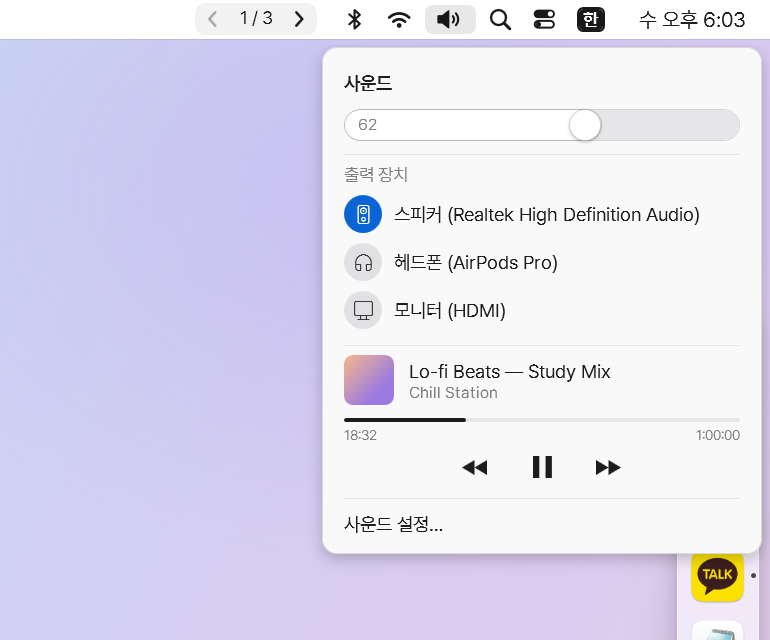 | 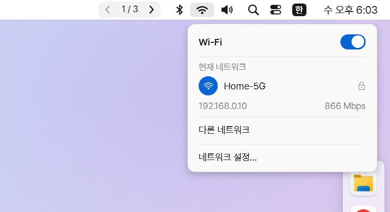 |

| 블루투스 | 제어 센터 |
|---|---|
| 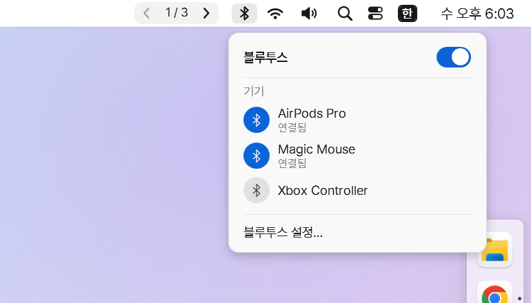 | 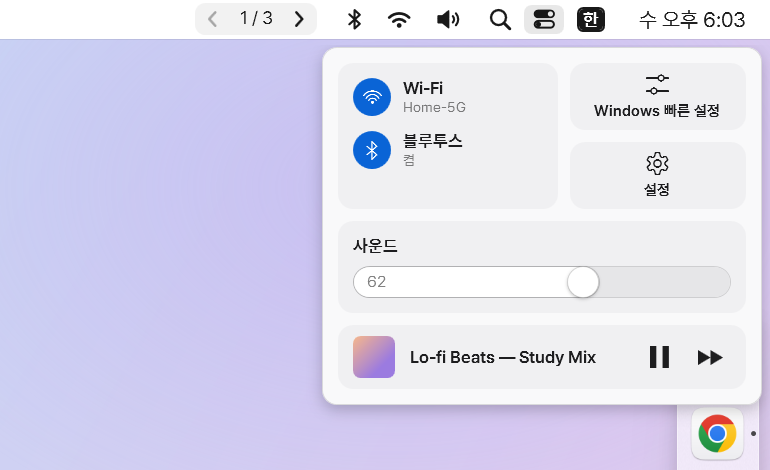 |

### 독

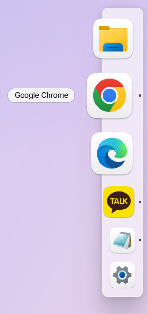

- 화면 왼쪽 / 오른쪽 / 아래 / 위 어디든 배치. 독의 빈 곳을 끌어서 옮긴다
- **순서 바꾸기**: 아이콘(과 구분선)을 끌어서 옮긴다. 실행 중인 앱 아이콘을 고정 영역으로 끌어 놓으면 그 자리에 고정
- **제거**: 고정 아이콘을 독 밖으로 끌어내 "제거" 가 보일 때 놓는다. 끄는 중 오른쪽 클릭(또는 Esc)이면 취소
- **파일로 고정**: 탐색기·바탕화면의 앱(.exe), 바로 가기(.lnk), 인터넷 바로 가기(.url), 폴더를 독에 끌어 놓으면 그 자리에 고정
- 동작: **항상 보이기(공간 차지)**(기본) / 자동 숨김(가장자리에 마우스를 대면 나타남) / 항상 표시(창 위에 겹침)
- 반투명 블러 배경, 라이트 / 다크 / 시스템 테마, 맥처럼 주변 아이콘이 함께 커지는 확대
- 모든 아이콘을 macOS 규격(같은 크기·여백·둥근 사각형·그림자)으로 맞춤. 윈도우 앱은 흰 판 위에 표시
- 알림은 바운스 없이 작은 빨간 점
- **앱 켜기 반응**: 누르면 아이콘이 살짝 눌리고, 창이 뜰 때까지(최대 10초) 아이콘이 통통 튀며 실행 점이 바로 보인다. 설정 → 독 → "앱 켤 때" 에서 점 깜빡이기로 바꿀 수 있다. 창을 기다리는 동안 다시 눌러도 두 번 실행하지 않는다
- 스토어 앱은 AUMID 로 저장 → 앱 업데이트 후에도 핀이 풀리지 않음

<br clear="right">

| 창이 여러 개인 앱을 누르면 | 오른쪽 클릭 |
|---|---|
| 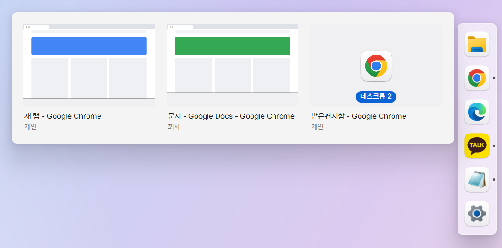 | 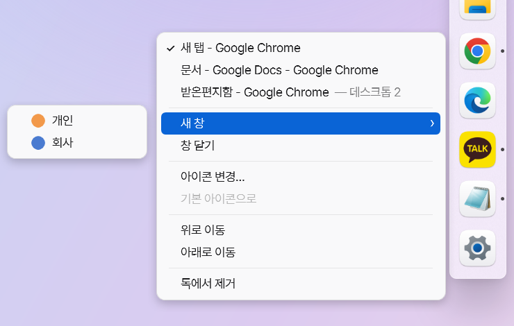 |

- **창 선택**: 실시간 미리보기로 창을 고른다. 다른 가상 데스크톱의 창은 "데스크톱 N" 으로 표시되고, 고르면 그 데스크톱으로 이동한다.
- **오른쪽 클릭**: 열린 창 목록, 크롬·엣지·웨일은 프로필별 새 창, 고정 / 제거 / 순서 / 아이콘 변경.

## 설정 창

트레이 아이콘 오른쪽 클릭, 상단바 로고 메뉴, 독 빈 곳 오른쪽 클릭에서 **"mongdock 설정…"** 을 누르면 열린다. 독·상단바·알림·캘린더·검색 설정을 모두 클릭만으로 바꾸고, 바꾸는 즉시 반영된다.

**새로운 기능 안내**: 처음 설치하면 독·상단바 위 말풍선으로 주요 기능을 둘러보고, 업데이트하면 그 사이 새 기능을 짚어 준다(그 밖에 바뀐 점과 놓친 이전 버전은 마지막 카드에 요약). 다시 보려면 트레이 메뉴 "새로운 기능 보기" 또는 설정 → 정보 → "새로운 기능 보기"/"둘러보기 다시 보기".

애니메이션은 윈도우 "애니메이션 효과" 설정(설정 → 접근성 → 시각 효과)을 따른다. 끄면 메뉴·배너·호버가 애니메이션 없이 바로 나타난다.

## 켜고 끄기

- 알림 영역(트레이) 아이콘 왼쪽 클릭: **일시 정지** — 독·상단바를 숨기고 윈도우 기본 작업 표시줄로 돌아감. 다시 누르면 복귀
- 트레이 아이콘 오른쪽 클릭: 설정… / 독 보이기 / 상단바 보이기 / 일시 정지 / 윈도우 작업 표시줄 숨기기 / 로그인 시 자동 실행 / 설정 파일 열기 / 종료
- 상단바 로고 메뉴 → mongdock 에도 같은 항목이 있다
- 트레이 아이콘이 안 보이면(윈도우 11 은 새 아이콘을 "^" 안에 숨김) `mongdock.exe` 를 한 번 더 실행해도 일시 정지가 풀린다
- "윈도우 작업 표시줄 숨기기" 는 새로 설치하면 **기본으로 켜져 있다**. mongdock 이 켜져 있을 때만 숨기고, 일시 정지·종료하거나 오류로 꺼지면 원래대로 돌려놓는다
  - 윈도우 작업 표시줄 자동 숨김을 안 쓰는 PC 에선 숨기는 동안만 자동 숨김을 잠깐 켜서(작업 표시줄 자리에 빈 띠가 남지 않게) 끌 때·일시 정지·종료 때 다시 끈다. 원래부터 자동 숨김을 쓰던 PC 는 건드리지 않고, 그 사이 윈도우 설정에서 직접 자동 숨김을 껐다면 그대로 둔다
  - 원래 상태는 `%APPDATA%\mongdock\cache	askbar-state.json` 에 적어 둔다. 강제 종료돼 이 파일이 남으면 다음 실행 때(숨기기가 꺼져 있으면) 원래대로 돌리고, 제거할 때도 `mongdock.exe --restore-taskbar` 로 되돌린다
  - 처음 켤 때 윈도우 작업 표시줄에 고정해 둔 앱 중 독에 없는 것을 작업 표시줄 순서대로 독 끝에 가져온다 (설정 > 독 > "작업 표시줄 고정 앱 가져오기" 로 언제든 다시)
- 명령줄 `mongdock.exe --exit` 로 실행 중인 mongdock 을 정상 종료할 수 있다 (트레이 "종료" 와 같음)

### 지우기
설치 프로그램으로 설치했다면: **설정 → 앱 → 설치된 앱 → mongdock → 제거**. 실행 중인 mongdock 을 끄고, 자동 실행 등록과 바로 가기를 지운다. 몽독에서 바꾼 윈도우 알림 소리는 제거할 때 원래대로 돌아간다 (제거 전에 직접 다른 소리로 바꿨다면 그대로 둔다). 마지막에 "설정도 지울까요?" 에서 "예" 를 고르면 `%APPDATA%\mongdock` 도 지운다 (기본은 남김).

zip 으로 썼다면:
1. 알림 소리를 바꿨다면 설정 > 상단바 > 알림 소리에서 "원래대로" → 트레이 메뉴에서 "로그인 시 자동 실행" 끄기 → 종료
2. 압축을 푼 폴더 삭제
3. (선택) 설정·로그 폴더 `%APPDATA%\mongdock` 삭제

## 설정

대부분은 [설정 창](#설정-창)에서 바꾸면 된다. 파일로 직접 고치려면 `%APPDATA%\mongdock\settings.json` — 저장하면 바로 반영된다.

| 항목 | 예 |
|---|---|
| 독 위치·동작·크기·테마 | `dock.edge` (기본 `Bottom`), `dock.mode` (기본 `Reserve` = 항상 보이고 공간 차지), `dock.iconSize`, `dock.hoverScale`, `dock.theme`, `dock.launchAnimation` (앱 켤 때: 기본 `Bounce`, `Blink`) |
| 독 모니터 | `dock.monitor` — 장치 이름(예 `"\\\\.\\DISPLAY2"`), `""` 이면 주 모니터 |
| 상단바 크기 | `topBar.height` (기본 26), `topBar.fontSize` (기본 13) |
| 상단바 색·표시 항목 | `topBar.colorMode` (`Auto`(기본, 앱 색에 맞춤)/`Fixed`/`Transparent`/`Blur`), `topBar.background`, `topBar.showAppMenus` … |
| 상단바 모니터 | `topBar.showOnAllMonitors` — `false` 면 주 모니터에만 |
| 앱 트레이 아이콘 | `topBar.showTrayIcons` (속성 기본 `false` — 새 설치는 `true`, 작업 표시줄 숨기기를 켜면 자동으로 `true`), `topBar.trayIconsVisibleCount` (상단바에 바로 보일 최대 개수, 기본 10 — 넘으면 ⌃ 안으로), `topBar.trayIconPlacement` (몽독에서 옮긴 자리 — 키는 GUID 또는 `"exe이름:uID"`, 값 `{ "onBar": true, "order": 0 }`, 비우면 윈도우 설정대로) |
| 시계 달력 | `topBar.calendarApp` (날짜를 두 번 누르면 열 캘린더: `Google`/`OutlookWeb`/`Naver`/`NewOutlook`/`ClassicOutlook`/`WindowsCalendar`), `calendar.refreshMinutes` (구독 캘린더 새로고침 주기, 기본 15분) |
| 검색 | `topBar.searchMode` (`Spotlight`/`Windows`), `topBar.spotlightHotkey` (`Auto`/`WinSpace`/`AltSpace`/`CtrlSpace`/`None`) |
| 검색 항목 | `search.apps` · `settings` · `calculator` · `folders` · `documents` · `media` · `otherFiles` · `webSearch` · `windowsSearch` (기본 모두 `true`), `search.fileSearchFolders`, `search.maxPerCategory` (기본 5), `search.webSearchEngine` (`Google`/`Naver`/`Bing`) |
| 알림 | `notifications.showNotificationBanners` (기본 `true`), `notifications.hideWindowsToastPopups` (기본 `true`) |
| 글꼴 | `fontFamily` — 기본 `"Pretendard"`(내장), 설치된 글꼴 이름도 가능 |
| 앱 메뉴 직접 정의 | `appMenus` — 키는 exe 이름(예 `"chrome.exe"`), 항목마다 `text` 와 `keys`(예 `"Ctrl+Shift+T"`) |
| 앱 메뉴 규칙 갱신 | `updateMenuRules` (기본 `true`) — `false` 면 [앱 메뉴 규칙](#앱-메뉴-규칙)을 GitHub 에서 받지 않음 |
| 앱 창 메뉴 줄 숨기기 (실험) | `topBar.hideNativeMenuBars` (기본 `false`) — 메모장·워드패드·그림판·레지스트리 편집기 같은 시스템 앱 창 안의 메뉴 줄을 떼고 상단바에서만 보이게. 끄거나 일시 정지·종료하면 되돌림 |
| 업데이트 확인 | `checkForUpdates` (기본 `true`) — 시작 1분 뒤와 12시간마다 GitHub 릴리스 확인 |
| 핀 목록 | `pins` |

색 문자열이 `""` 이면 테마 기본값. 첫 실행 때 MyDockFinder 의 `ico.ini` 가 있으면 핀 목록을 가져오고(그 뒤 작업 표시줄 고정 앱 중 없는 것 추가), 없으면 Finder·Launchpad 다음에 윈도우 작업 표시줄 고정 앱을 작업 표시줄 순서대로 둔다(파일 탐색기 제외, 고정 앱이 없으면 Finder·Launchpad·브라우저·설정).

로그: `%APPDATA%\mongdock\logs\mongdock.log`

## 앱 메뉴 규칙

브라우저·탐색기·VS Code·카카오톡·디스코드·노션처럼 윈도우 메뉴가 없는 앱의 상단바 단축키 메뉴는 [`menus/app-menus.json`](menus/app-menus.json) 에 들어 있다. 몽독은 이 파일을 앱 안에 담아 두고(오프라인·첫 실행용), 켜진 지 2분 뒤와 그 뒤 하루에 한 번 GitHub `menus-stable` 브랜치의 같은 파일을 받아 바로 적용한다. 그래서 **새 앱 메뉴는 몽독 새 버전 없이 이 파일만 고치면** 모든 사용자에게 반영된다. 받은 파일은 `%APPDATA%\mongdock\cache\app-menus.json` 에 저장되고, 내장 파일과 비교해 `revision` 이 높은 쪽을 쓴다.

```jsonc
{
  "schema": 1,          // 형식 버전. 몽독이 모르는 schema 면 파일 전체를 무시
  "revision": 2,        // 고칠 때마다 1씩 올림 (로그에 남음)
  "apps": [             // 위에서부터 처음 맞는 규칙 하나를 씀
    {
      "id": "vscode",
      "match": { "exe": ["code.exe", "cursor.exe"], "aumid": ["..."], "windowClass": ["..."] },  // windowClass 는 선택
      "appMenu": [ { "text": "설정…", "keys": "Ctrl+," } ],   // 앱 이름(굵게) 메뉴 맨 위에 붙는 항목
      "menus": [
        { "title": "파일", "items": [
          { "text": "새 텍스트 파일", "keys": "Ctrl+N" },
          { "text": "폴더 열기…", "keys": ["Ctrl+K", "Ctrl+O"] },  // 연속 입력 (최대 4개)
          "-",                                                     // 구분선 ({ "separator": true } 도 가능)
          { "text": "확대/축소", "items": [ { "text": "확대", "keys": "Ctrl+=" } ] },  // 하위 메뉴 (한 단계)
          { "text": "창 닫기", "action": "close" }                 // 창 동작: close / minimize / maximize / restore
        ] }
      ]
    }
  ]
}
```

- **추가 방법**: 저장소에서 `menus/app-menus.json` 을 고쳐 PR 을 보내거나(관리자는 직접 수정), `revision` 을 1 올린다. 규칙 변경은 `main` 에서 검토 후 `menus-stable` 로 옮기며, 옮긴 뒤 하루 안에 모든 사용자에게 적용된다. 실제 파일은 주석 대신 맨 위 `_doc` 에 설명이 있다.
- **키 이름**: `A`~`Z`, `0`~`9`, `F1`~`F24`, `Left`/`Right`/`Up`/`Down`, `Tab`, `Enter`, `Esc`, `Space`, `Backspace`, `Delete`, `Insert`, `Home`, `End`, `PageUp`, `PageDown`, `NumPad0`~`9`, `` = - , . / ; ` [ \ ] ' `` 와 수식키 `Ctrl`/`Shift`/`Alt`.
- **안전 규칙**: 메뉴 글자와 단축키, 위의 창 동작 네 가지만 쓸 수 있다(프로그램 실행·URL 열기 없음). `Win` 조합·`Alt+Tab`·`Ctrl+Esc`·`Ctrl+Shift+Esc`·`Ctrl+Alt+Delete`·`Shift+Delete`(영구 삭제)·`Alt+F4`(창 닫기는 `"action": "close"`) 는 거부. `Ctrl+W`·`Ctrl+F4` 는 허용. 파일 512KB·앱 300개·메뉴당 항목 80개 상한. 잘못된 앱 항목은 그 앱만 버리고 로그에 남긴다.
- 우선순위: 설정의 `appMenus` > 앱의 윈도우 메뉴 > 이 규칙 > UI 자동화 메뉴 막대 > Electron/기본 메뉴.

## 라이선스

- 내장 글꼴 [Pretendard](https://github.com/orioncactus/pretendard) — SIL Open Font License 1.1 (`src/mongdock/Fonts/OFL.txt`)
